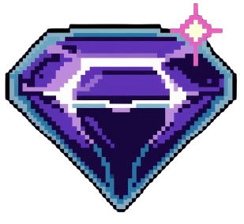

# EdaQuest 🎮📚

<!-- <div align="center"> -->
<!--    -->
<!--   > Where Education Meets Adventure in the Digital Realm -->
<!-- </div> -->

EdaQuest is a blockchain-powered educational gaming platform that transforms learning into epic quests. Built with a retro-futuristic aesthetic, it combines nostalgic gaming elements with modern educational technology.

## Features 🚀

- **Quest-Based Learning**: Interactive educational modules designed as gaming quests
- **Blockchain Integration**: Secure, verifiable learning achievements
- **Progress Tracking**: Real-time XP and achievement system
- **Module Library**: Curated educational content with clear progression paths

## Tech Stack 💻

- **Frontend**: Next.js, TailwindCSS
- **Authentication**: Privy
- **Blockchain**: Ethereum, Hardhat
- **Smart Contracts**: Solidity
- **Styling**: Custom retro-futuristic UI components

## Getting Started 🎮

```bash
# Clone the repository
git clone https://github.com/yourusername/edaquest.git

# Install dependencies
cd edaquest
npm install

# Set up environment variables
cp .env.example .env.local

# Run the development server
npm run dev
```

<!-- ## Environment Variables 🔑 -->
<!---->
<!-- ```env -->
<!-- NEXT_PUBLIC_PRIVY_APP_ID=your_privy_app_id -->
<!-- NEXT_PUBLIC_CONTRACT_ADDRESS=your_contract_address -->

## Project Structure 📁

```
edaquest/
├── backend/                # hardhad
├── frontend/               # nextjs directory
    ├── app/                # Next.js app directory
    ├── components/         # React components
    ├── contracts/          # Smart contracts
    ├── styles/             # Global styles
    ├── public/             # Static assets
    └── scripts/            # Deployment scripts

```

## Design System 🎨

- **Colors**:

  - Primary: `#676FE8` (Neon Purple)
  - Secondary: `#4B50BE` (Cyber Blue)
  - Background: `#0A0A1E` (Dark Space)
  - Accent: `#FF2E6C` (Neon Pink)

- **Typography**:
  - Headings: Press Start 2P
  - Body: Inter

---

Built with 💜 by EdaQuest Team

Note: All rights reserved. This code is proprietary and confidential.
